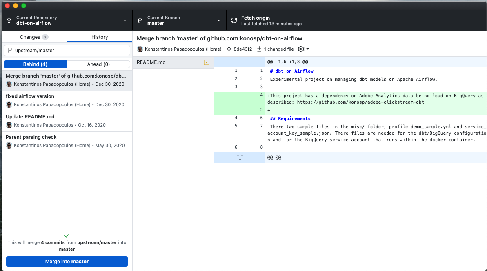

# atom-data-assignments
Data skills &amp; Quantitative methods - DATAcracy ATOM assignments

## Fork & Update Forked Repo
* Fork repo này về Github space của bạn
* Dùng [Github Desktop](https://desktop.github.com/) để update repo đã forked của bạn, với các thay đổi trên repo gốc của DataCracy:

1. Lab giới thiệu Github Desktop [HERE](https://anhdang.gitbook.io/datacracy/atom/2-data-tools-1/2.3-lab-1-github-desktop)
2. Trước khi update từ Repo gốc (Upstream): `Fetch Origin` => `Commit Changes` (if any) => `Push origin` (Thay đổi sẽ update lên Github)
3. Trên thanh Menu của Github Desktop: `Branch` / `Compare to Branch` => Chọn: `upstream/master` branch
4. Check Behind(x) nghĩa là repo của bạn đang "trễ" 3 thay đổi so với repo gốc. Ahead(x) nghĩa là repo của bạn có 3 thay đổi mới so với repo gốc của chương trình
5. Bên dưới panel *"This will merge x commits from `upstream/master` to `master`"* => Upstream là repo gốc của DataCracy, khi bạn nhấn **Merge into master** bạn sẽ merge những thay đổi mới của DataCracy vào repo trên space của bạn

## DataCracy Docs
* Tổng hợp tài liệu của DataCracy: [HERE](https://anhdang.gitbook.io/datacracy/)
* Nội dụng ATOM Class:
    * [Assgignment 2](./assignment_2): Automate Email, API, Web Scraping
    * [Assgignment 3](./assignment_3): Slack API. JSON to DataFrame. To Google SpreadSheet
    * [Assgignment 4](./assignment_4): Database Design (QuickDBD) & SQL (`duckdb`)

## Acknowledge
The contents are developed & curated by: 
* [@anhdanggit](https://github.com/anhdanggit): Co-founder & Chief Technical Contents
* [@tranctan](https://github.com/tranctan): Mentor
