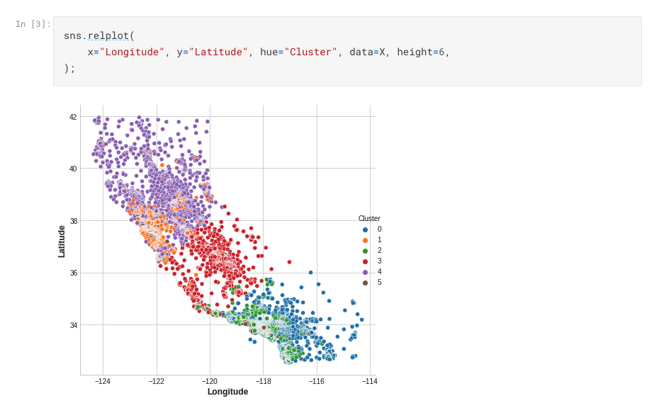
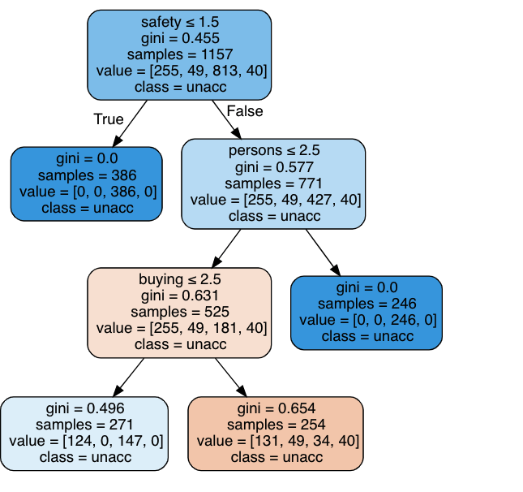

# README

**Mục đích của bài Assignment**
*  Luyện tập EDA
*  Tự đặt các câu hỏi và phân tích
*  Làm quen với Linear Regressions
* Làm quen với Clustering (K-mean)
* **[Optional]** Làm quen với Decision Tree

**Các kiến thức áp dụng**
* Python Pandas
* Data Visualization
* Linear Regressions

**Submission**
Tạo notebook (trên Github hoặc Kaggle) và trình bày code và kết quả các bước sau.

## TODO 1: EDA
* Sử dụng bộ data [Kaggle - Ecommerce Customers](https://www.kaggle.com/srolka/ecommerce-customers)

## EDA
* Univariate Analysis: 
    - Trình bày các quan sát về phân phối của các biến
    - Bộ Data có các điểm nào cần chú ý (để thực hiện trong bước Data Processing)?
* Multivariate Analysis: 
    - Trình bày các tương tác thú vị giữa các biến, giải thích thêm theo ý kiến và suy nghĩ của bạn
## Customer Yearly Amount Spent
Yếu tố chúng ta quan tâm nhất là `Yearly Amount Spent` (Số tiền giao dịch của khách hàng trong năm)

Tự đặt các giả thuyết về yếu tố ảnh hướng (trong bộ data) và làm các bước phân tích, vẽ các biểu đồ để tìm hiểu các giả thuyết đó.

## TODO 2: LINEAR REGRESSIONS
Xem lại Lab về Linear Regressions. Tìm hiểu thêm các notebook khác trên Kaggle. 

Thực hiện bài toán Linear Regression với biến target (y) là `Yearly Amount Spent`. 
Lưu ý trình bày đầy đủ các bước:
* Data Processing
* Split Train & Test Data
* Modeling
* Evaluation

## TODO 3: CUSTOMER CLUSTERING
Tham khảo notebook sau: [Clustering with K-Means](https://www.kaggle.com/ryanholbrook/clustering-with-k-means#k-Means-Clustering)

* Áp dụng phương pháp Clustering lên bộ data để chia customers thành n nhóm (n tuỳ theo bạn lựa chọn)
* Trên n nhóm đã phân ra bằng clustering, trình bày chỉ số thông kê và phân phối của các biến sau: `Time on App`, `Avg. Session Length`, `Time on Website`, `Length of Membership`
* Visualize plot các yếu tố trên theo cặp. Ví dụ như bên dưới (cluster = các nhóm khác hàng đã chia)

* Trình bày các quyết định, chiến lược kinh doanh có thể thực hiện dựa trên kết quả của clustering để giúp tăng doanh thu.

## TODO 4 (OPTIONAL) DECISION TREE
* Tạo biến `HighVal_Cust` (High-value Customers) là những khách hàng có `Yearly Amount Spent` > 80% percentiles của mẫu data. 
* Tham khảo notebook sau: [Decision-Tree Classifier Tutorial](https://www.kaggle.com/prashant111/decision-tree-classifier-tutorial)
* Dùng Decision Tree để phân loại `HighVal_Cust`
* Visualize Decision Tree giúp phân loại các khách hàng có giá trị cao.

